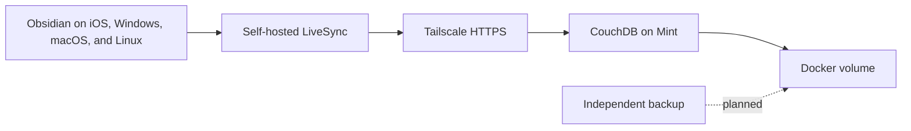

# Black Cloud

This Mint computer hosts private services for the owner's devices. The first service is
Obsidian synchronization for Black Vault.

## Architecture



Self-hosted LiveSync is the only live writer between devices. Do not combine it with Obsidian
Sync, iCloud Drive, Syncthing, Nextcloud sync, or another file synchronization service for the
same vault. Git remains available for deliberate version history and recovery.

CouchDB listens only on `127.0.0.1:5984`. Tailscale Serve publishes it to devices authenticated
to the same tailnet with a valid private HTTPS certificate. The CouchDB port is not opened on the
LAN or public internet.

## Host setup

The Linux Mint package manifest installs Docker and Docker Compose. After package restoration,
initialize the service once:

```bash
bash ~/.dotfiles/scripts/black-cloud.sh init
```

The command creates random CouchDB credentials in
`~/.config/black-cloud/livesync.env`, starts the pinned CouchDB container, creates the
`black-vault` database, and publishes it through Tailscale Serve. The credential file is local
state and must never be committed.

Check the service with:

```bash
bash ~/.dotfiles/scripts/black-cloud.sh status
bash ~/.dotfiles/scripts/black-cloud.sh endpoint
```

## First Obsidian device

1. Make a current Git commit or other backup of Black Vault.
2. Install and enable the `Self-hosted LiveSync` community plugin.
3. Choose the first-time setup flow and configure a CouchDB remote manually.
4. Use the private HTTPS endpoint, database `black-vault`, and credentials from
   `~/.config/black-cloud/livesync.env`.
5. Enable end-to-end encryption with a strong passphrase stored in the password manager.
6. Test the connection and initialize the empty remote from this Mint vault.
7. Leave optional hidden-file and customization synchronization disabled until ordinary notes
   and attachments synchronize correctly.
8. Create a fresh encrypted Setup URI from the working device for each additional device.

Keep each Setup URI separate from its Setup URI passphrase. The vault encryption passphrase is
a third secret and must also be stored safely.

## Additional devices

Install Tailscale, Obsidian, and Self-hosted LiveSync on each iPhone, iPad, Windows computer, or
Mac. Sign in to the same tailnet, create an empty local vault, and import the Setup URI generated
by the working first device. Keep Obsidian open until initial synchronization finishes.

## Storage and backup boundary

The CouchDB Docker volume is durable local storage, but it is not a backup. A deleted or corrupt
record can synchronize to every client. The next cloud phase should add encrypted snapshots to
an external disk and a second physical location. General file storage belongs in a separate
Nextcloud service so its file synchronization cannot interfere with LiveSync.
