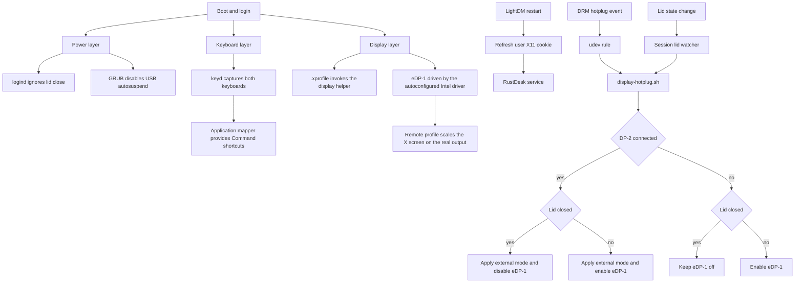

# MacBook Pro 2015 Linux Mint Cinnamon Setup Guide

This machine uses Linux Mint Cinnamon on X11 with a 2015 MacBook Pro, Intel Iris Graphics
6100, a 3440 by 1440 external display on `DP-2`, RustDesk remote access, a Corne keyboard,
and a DP plus USB KVM.

The active configuration is stored in this repository and linked into the home directory and
`/etc`. The XDG autostart method is documented as a fallback and is not installed because
`.xprofile` is active.

## Architecture



| Layer | Purpose | Managed files |
|---|---|---|
| Display | Physical hotplug on the real panel and any external head | `os/linux/home/.xprofile`, `os/linux/home/display-hotplug.sh`, `os/linux/home/rustdesk-display.sh`, `os/linux/home/display-lid-watch.desktop`, `os/linux/system/etc/X11/xorg.conf.d/99-rustdesk-dummy.conf.disabled`, `os/linux/system/etc/udev/rules.d/95-monitor-hotplug.rules` |
| Remote access | Keep RustDesk ordered after LightDM with a current X11 cookie | `os/linux/system/usr/local/libexec/rustdesk-sync-xauth`, `os/linux/system/etc/systemd/system/rustdesk.service.d/10-dotfiles.conf` |
| Keyboard | macOS-style Command shortcuts with native terminal Ctrl | `os/linux/system/etc/keyd/default.conf`, `os/linux/home/keyd/app.conf`, `os/linux/home/keyd-application-mapper.desktop` |
| Gestures and scrolling | Three-finger workspace navigation and smoother two-finger scrolling | Cinnamon `org.cinnamon.gestures` settings, Touchégg, `os/linux/system/etc/X11/xorg.conf.d/90-bcm5974.conf` |
| Power | Clamshell mode and USB reconnect reliability | `os/linux/system/etc/systemd/logind.conf.d/lid.conf`, `os/linux/system/etc/default/grub` |

## The parked dummy output

`99-rustdesk-dummy.conf` is installed with a `.disabled` suffix and Xorg only parses `*.conf`,
so it has no effect. It defines a `Monitor`, a `Device` with `Driver "dummy"` and a `Screen`.
A `Screen` section anywhere under `xorg.conf.d` suppresses autoconfiguration, so Xorg builds
its layout from that screen alone and the Iris 6100 on `eDP-1` never joins the server. The
laptop then boots to a greeter rendered on a 2048x1536 virtual head while the panel keeps
showing the last line the kernel console printed. Typing a password into a login screen you
cannot see is what that looks like from the keyboard.

RustDesk does not need it here. This machine has a built-in panel that is always connected, so
RustDesk shares the real screen. Rename the file to `.conf` only for a genuinely headless host,
and expect the physical output to go dark when you do.

## Lid closed and the remote framebuffer

Switching the only output off leaves the X screen with no framebuffer, and RustDesk then has
nothing to capture. That emptiness is what the dummy head used to cover. With the lid shut and
no external monitor, `display-hotplug.sh` now reapplies the saved remote profile on `eDP-1`
rather than running `xrandr --output eDP-1 --off`, so a real framebuffer always exists.

The panel is blanked with DPMS rather than switched off, so nothing is lit inside a closed
clamshell while the framebuffer stays intact. Measured at the iphone profile:

| Approach | X screen | `xwd -root` capture |
|---|---|---|
| `xrandr --output eDP-1 --off` | 320x200 | 259 KB |
| brightness 0 | 1600x736 | 4.71 MB |
| `xset dpms force off` | 1600x736 | 4.71 MB |

Switching the output off collapses the screen to its minimum and leaves a remote client with
nothing worth capturing. Brightness 0 captures fine but `systemd-backlight@.service` saves it at
shutdown and restores it at boot, so the machine comes up with an invisible login screen, the
exact failure this path exists to prevent. DPMS keeps no state across a reboot and any input
undoes it, so it cannot strand the panel dark.

This machine runs with no DPMS timeouts at all, `xset` reports `Standby: 0 Suspend: 0 Off: 0`,
so a bare `xset dpms force off` is one shot. The next input wakes the panel and nothing ever
blanks it again, which is how the panel ends up lit behind a shut lid hours later. `panel_off`
therefore sets an off timeout for as long as the lid is closed, so the blank re-arms itself
after every wake, and `panel_on` puts the timeouts back to zero so an open lid never blanks on
a timer of ours.

Cinnamon's screensaver and power stack write DPMS as well, and they clobber it two different
ways. A restart of either puts the timeout back to zero. Switching DPMS off outright leaves the
timeouts untouched, so `xset` still reports `Off: 60` while `DPMS is Disabled`, the connector at
`/sys/class/drm/*-eDP-1/dpms` reads `On`, and the panel is lit inside a shut clamshell. Both
turn the blank back into a one shot, and a drift check that reads the off seconds alone is blind
to the second one, because 60 still looks like the value it asked for. That is how a closed lid
ends up glowing until somebody opens it.

The lid watcher therefore re-checks every 30 seconds while the lid is closed and compares the
off timeout and the enable flag together, re-arming both when either has drifted. It re-asserts
the timeout and the flag, never the blank itself, so it can never darken a panel somebody is
looking at. The panel then goes dark on its own once `PANEL_BLANK_SECONDS` of X idle have
passed.

X also keeps its own idea of the DPMS level, and that bookkeeping can drift away from the
hardware. Observed on this machine behind a shut lid: `xset` reporting `DPMS is Enabled` and
`Monitor is Off` while `/sys/class/drm/*-eDP-1/dpms` read `On` and `intel_backlight` sat at 1101
of 1388 with `bl_power` 0. The panel was lit and every software check looked correct. X issues
no further blank from there, because as far as it is concerned the panel is already dark, so
nothing in the session ever recovers on its own. `xset dpms force off` resyncs both and drops
the backlight to 0.

The connector is the authority, not `xset`. The watcher therefore also compares the two while
the lid is closed and forces the blank when X believes the panel is dark and the connector says
it is lit. That condition is the desync itself, so it can never darken a panel somebody is
looking at, and a remote viewer is unaffected either way because DPMS leaves the framebuffer
intact.

X lags its own bookkeeping for about nine seconds after every wake, reporting `Monitor is Off`
while the panel is already lit, and that transient clears on its own. Blanking inside it would
darken a panel somebody just woke, so the watcher requires the desync to survive two consecutive
checks before it forces anything.

`PANEL_BLANK_SECONDS` controls that timeout and defaults to 60. Remote input keeps the panel lit
while a session is actively in use and it goes dark a minute after the input stops. Capture is
unaffected either way.

The lid watcher acts on lid transitions only. It previously also reran the whole path once a
second for as long as the lid was shut and `eDP-1` was still enabled, to undo something
re-enabling the panel behind a closed lid. Keeping `eDP-1` enabled with the lid shut is now the
intended state, so that condition would match forever and reapply the profile every second,
fighting anything else touching the screen.

`display-hotplug.sh` must be executable. Both callers, the udev DRM rule and the
`display-lid-watch` autostart, invoke it by path, and `.xprofile` swallows its errors, so a lost
execute bit disables the whole display path in silence.

## Restore

The guarded `restoration_scripts/10-linux-mint-macbook.sh` links the user files:

```text
~/.xprofile -> ~/.dotfiles/os/linux/home/.xprofile
~/.local/bin/display-hotplug.sh -> ~/.dotfiles/os/linux/home/display-hotplug.sh
~/.local/bin/rustdesk-display -> ~/.dotfiles/os/linux/home/rustdesk-display.sh
~/.config/autostart/display-lid-watch.desktop -> ~/.dotfiles/os/linux/home/display-lid-watch.desktop
~/.config/keyd/app.conf -> ~/.dotfiles/os/linux/home/keyd/app.conf
~/.config/autostart/keyd-application-mapper.desktop -> ~/.dotfiles/os/linux/home/keyd-application-mapper.desktop
```

The same installer links the system files that remain readable during their consumers' startup:

```text
/etc/udev/rules.d/95-monitor-hotplug.rules -> ~/.dotfiles/os/linux/system/etc/udev/rules.d/95-monitor-hotplug.rules
/etc/default/grub -> ~/.dotfiles/os/linux/system/etc/default/grub
```

The installer copies these early-boot files as root-owned regular files:

```text
/etc/keyd/default.conf
/etc/X11/xorg.conf.d/90-bcm5974.conf
/etc/X11/xorg.conf.d/99-rustdesk-dummy.conf.disabled
/etc/systemd/logind.conf.d/lid.conf
/etc/systemd/system/rustdesk.service.d/10-dotfiles.conf
/usr/local/libexec/rustdesk-sync-xauth
```

keyd drops privileges before parsing its configuration, and system services must not execute
through a user-writable checkout. Root-owned copies avoid both mode `0700` home-directory
traversal failures and privilege-boundary symlinks. The restore script uses `sudo install` with
explicit owner and mode instead of changing ownership inside the repository.

The installer runs only on Linux Mint installed on `MacBookPro12,1`. It skips macOS, WSL, and
other native Linux systems. It links an existing regular file only when it exactly matches the
managed copy. It moves the original to `<target>.pre-dotfiles`. A different file or existing
backup blocks installation for manual review.

Apply the complete managed setup with:

```bash
DOTFILES_PATH="$HOME/.dotfiles" bash "$HOME/.dotfiles/restoration_scripts/10-linux-mint-macbook.sh"
```

The installer also enables and starts keyd, adds the desktop user to the trusted `keyd` group,
then reloads its mapping. Log out and back in after the first group assignment. Reboot after a
GRUB or lid configuration change.

## RustDesk remote display

The apt baseline installs `xauth` and `xserver-xorg-video-dummy`. RustDesk itself remains a
manual `.deb` installation because its release package is not part of the Mint apt baseline.
The restore script enables its non-secret unattended-access options for both the desktop user
and root service configuration. The permanent password and RustDesk identity stay machine-local
and are never stored in Git.

Set the password once after installing RustDesk:

```bash
bash -c 'read -r -s -p "Permanent RustDesk password: " rustdesk_password; printf "\n"; sudo /usr/bin/rustdesk --password "$rustdesk_password"; unset rustdesk_password'
sudo /usr/bin/rustdesk --get-id
```

`rustdesk-display` drives the real panel. The profile geometry becomes the X screen through
`xrandr --fb W\xH --output eDP-1 --mode <native> --scale-from W\xH`, and RustDesk captures that
screen. The panel keeps its own 2560 by 1600 timing and the driver scales between the two, so a
profile that is not 16:10 looks stretched locally and arrives correct at the remote client. The
lid is shut whenever a remote profile is in use, so the local stretch is never seen.

Each call detaches the output with `--output eDP-1 --off` before setting the new geometry.
`RRSetScreenSize` refuses any screen size that no longer contains every active output, and with
a transform in play that refusal fires even at an exact fit, so shrinking the screen while the
output is live cannot be made to work. Two further traps are worth knowing: a bare `xrandr --fb`
is silently ignored and reports success, so `--fb` only takes effect alongside an `--output`
action, and RandR applies asynchronously, so the result has to be read back rather than assumed.
`set_geometry` verifies the screen size and retries, and falls back to `--auto` so a failed
change can never leave the panel detached and dark.

| Profile | X screen | Use |
|---|---|---|
| `macbook` | 1920 by 1248 | Readable text on the 3024 by 1964 Retina client |
| `macbook-hires` | 2560 by 1662 | More remote workspace with the same MacBook aspect ratio |
| `ultrawide` | 3440 by 1440 | Ultrawide-shaped remote canvas |
| `iphone` | 1600 by 736 | iPhone 17 Pro landscape ratio |
| `native` | 2560 by 1600 | The panel's own resolution, unscaled. Not saved as the profile |

Switch profiles without `sudo` or a display-manager restart:

```bash
rustdesk-display macbook
rustdesk-display macbook-hires
rustdesk-display ultrawide
rustdesk-display status
```

The selected profile is stored in `~/.config/rustdesk-display/profile`. `.xprofile` reapplies it
on the next Cinnamon login. RustDesk remains on Adaptive Scale, while Cinnamon interface and
text scaling remain at 100 percent so changing profiles does not leak scaling preferences from
one client monitor to another.

The systemd drop-in orders RustDesk after LightDM and restarts it with the display manager. Its
`ExecStartPre` helper merges the current LightDM cookie into the desktop user's `.Xauthority`,
preventing `Invalid MIT-MAGIC-COOKIE-1` after a login or display-manager restart.

The restore script deliberately does not restart LightDM because that disconnects active GUI
sessions. Apply a newly installed Xorg or systemd configuration from a working SSH connection:

```bash
sudo systemctl restart display-manager
sudo systemctl restart rustdesk
```

The dummy Xorg device replaces the physical Intel outputs whenever it is active, so it ships
parked. See [The parked dummy output](#the-parked-dummy-output). The restore script installs it
as `.disabled` and deletes any active `.conf` copy an older run left behind, so physical `eDP-1`
and `DP-2` operation is the state you get without doing anything.

## Display resolution

The external monitor has no EDID readable by Linux, so X11 needs a custom modeline.

Test it manually with:

```bash
xrandr --newmode "3440x1440R" 319.75 3440 3488 3520 3600 1440 1443 1453 1481 +hsync -vsync
xrandr --addmode DP-2 "3440x1440R"
xrandr --output DP-2 --mode "3440x1440R" --primary
xrandr --output eDP-1 --off
```

### Login configuration

Live path: `~/.xprofile`

```bash
#!/bin/bash

# Give Cinnamon and the external display time to initialize, then reuse the
# idempotent hotplug path. Login must continue even if display setup fails.
sleep 3
DISPLAY_HOTPLUG_DELAY=0 "$HOME/.local/bin/display-hotplug.sh" >/dev/null 2>&1 || true
```

The helper treats an existing modeline as success, so repeated login and hotplug runs do not
raise an X profile error.

### XDG autostart alternative

Use this only if Cinnamon ignores `.xprofile`. Do not enable both methods.
The inactive templates are stored under `os/linux/home/alternatives/` and are not linked by
the restoration script.

`~/.config/autostart/xrandr-custom.desktop`:

```ini
[Desktop Entry]
Type=Application
Name=Custom Resolution
Exec=/home/black/.local/bin/set-resolution.sh
NoDisplay=true
X-GNOME-Autostart-enabled=true
```

`~/.local/bin/set-resolution.sh`:

```bash
#!/bin/bash
sleep 3
DISPLAY_HOTPLUG_DELAY=0 "$HOME/.local/bin/display-hotplug.sh" >/dev/null 2>&1 || true
```

## Display hotplug

The helper reads `/proc/acpi/button/lid/*/state` for every display layout. With the lid closed,
`eDP-1` remains off whether `DP-2` is connected or disconnected. With the lid open, the internal
panel is enabled by itself when `DP-2` is absent, or to the left of `DP-2` when it is present.
The udev rule invokes the helper when DRM state changes. The XDG session autostart entry also
runs the helper in watcher mode. The watcher handles lid changes and turns `eDP-1` off again if
Cinnamon enables it during a DisplayPort disconnect race.

Live path: `~/.local/bin/display-hotplug.sh`

```bash
# The tracked script is the executable reference.
sed -n '1,240p' "$HOME/.local/bin/display-hotplug.sh"
```

Live path: `/etc/udev/rules.d/95-monitor-hotplug.rules`

```udev
ACTION=="change", SUBSYSTEM=="drm", RUN+="/usr/bin/su black -c '/home/black/.local/bin/display-hotplug.sh'"
```

Reload the rule with:

```bash
sudo udevadm control --reload-rules
sudo udevadm trigger --subsystem-match=drm
```

## Display and font scaling

Cinnamon display and text scaling remain at 100 percent. The RustDesk profile changes the
remote framebuffer resolution instead, preserving readable text without applying a global
font preference to both the MacBook and ultrawide clients.

```bash
gsettings set org.cinnamon.desktop.interface text-scaling-factor 1.0
```

Font hinting is `Full`, sub-pixel rendering is `RGB`, and a panel height around 40 to 48 pixels
fits the external display.

## Keyboard shortcuts

`keyd` captures both the Apple internal keyboard and the Corne. Ctrl and Command retain their
native identities at the input layer. The session application mapper translates common
Command combinations into each application's Linux shortcuts.

Install `keyd` when it is absent:

```bash
sudo apt install git build-essential
git clone https://github.com/rvaiya/keyd.git
cd keyd
make
sudo make install
sudo systemctl enable --now keyd
```

Live path: `/etc/keyd/default.conf`, deployed from `os/linux/system/etc/keyd/default.conf`

```ini
[ids]
*

[main]
# Keep the configuration non-empty without changing normal keyboard behavior.
f24 = noop
```

Ctrl and Command retain their native identities because neither is remapped in the base
configuration. The unused F24 binding keeps `[main]` non-empty. An empty section and
self-referential Meta layer bindings pass `keyd check` in keyd 2.6.0 but are rejected during
the daemon's initial boot load.

Live path: `~/.config/keyd/app.conf`

The wildcard section maps common Command shortcuts, including Command+Comma for application
settings, to their Ctrl equivalents. The Obsidian section adds its macOS defaults for Quick
Switcher, editing view, graph view, and back/forward navigation. It also covers Markdown
formatting, link handling, checklist toggles,
comments, and zoom. Generic mappings cover Command+P for the Command Palette,
Command+Shift+F for global search, file operations, and standard editing shortcuts. The
`*terminal*` section appears first because keyd keeps the first duplicate binding when filters
overlap. It maps GNOME Terminal operations that use Ctrl+Shift, including copy, paste, new tab,
and close tab. Physical Ctrl remains unchanged, so `CTRL+A`, `CTRL+E`, `CTRL+U`, `CTRL+C`, and
other terminal controls continue to work normally.

The mapper starts from `~/.config/autostart/keyd-application-mapper.desktop`. The user must be
in the `keyd` group so it can access `/run/keyd.socket`.

Apply and inspect the mapping with:

```bash
sudo keyd reload
sudo keyd monitor
id -nG | grep -w keyd
pgrep -af keyd-application-mapper
```

The wildcard applies to all keyboards. To scope the mapping to the Corne, find its device ID
and replace `*` in `[ids]`:

```bash
cat /proc/bus/input/devices | grep -A 4 "Corne"
sudo keyd list-keys
```

## Trackpad gestures

Cinnamon's native gesture integration uses the Touchégg daemon on X11. Three-finger vertical
swipes toggle the workspace Expo view. Horizontal swipes move between adjacent workspaces:

```bash
gsettings set org.cinnamon.gestures enabled true
gsettings set org.cinnamon.gestures swipe-up-3 'TOGGLE_EXPO::end'
gsettings set org.cinnamon.gestures swipe-down-3 'TOGGLE_EXPO::end'
gsettings set org.cinnamon.gestures swipe-left-3 'WORKSPACE_NEXT::end'
gsettings set org.cinnamon.gestures swipe-right-3 'WORKSPACE_PREVIOUS::end'
gsettings set org.cinnamon.gestures swipe-percent-threshold 1
```

The 1 percent threshold minimizes the movement needed for recognition, matching the responsive feel
of normal scrolling. Touchégg keeps its automatic distance thresholds because it detects the
trackpad's physical size correctly.
The `bcm5974` driver can still discard occasional touch jumps, which prevents X11 gestures from
matching macOS reliability exactly.

### Scrolling feel

The libinput scroll pixel distance is 15, matching the driver default instead of the coarse
50-pixel value observed on this machine:

```xorg.conf
Section "InputClass"
    Identifier "MacBook bcm5974 smooth scrolling"
    MatchProduct "bcm5974"
    MatchIsTouchpad "on"
    MatchDriver "libinput"
    Option "ScrollPixelDistance" "15"
EndSection
```

This produces smaller, smoother scroll increments. Kinetic continuation after lifting the
fingers remains application-controlled on X11, so behavior can differ between browsers,
terminals, and other toolkits.

Touchégg must be installed and its system daemon running:

```bash
sudo apt install touchegg
systemctl status touchegg
```

## Clamshell mode

Live path: `/etc/systemd/logind.conf.d/lid.conf`

This path is a root-owned regular file. A symlink into the repository is unreadable to logind
during early boot because the home directory has mode `0700`.

```ini
[Login]
HandleLidSwitch=ignore
HandleLidSwitchExternalPower=ignore
HandleLidSwitchDocked=ignore
```

Cinnamon Power Management also sets the lid-close action to `Nothing` on battery and external
power. Its inactive action is also `Nothing` with a zero timeout on both power sources, so losing
the display, keyboard, and mouse through a USB switch does not suspend the machine. These settings
keep Tailscale and other network services reachable while the MacBook runs headless.

```bash
gsettings set org.cinnamon.settings-daemon.plugins.power lid-close-ac-action 'nothing'
gsettings set org.cinnamon.settings-daemon.plugins.power lid-close-battery-action 'nothing'
gsettings set org.cinnamon.settings-daemon.plugins.power sleep-inactive-ac-type 'nothing'
gsettings set org.cinnamon.settings-daemon.plugins.power sleep-inactive-ac-timeout 0
gsettings set org.cinnamon.settings-daemon.plugins.power sleep-inactive-battery-type 'nothing'
gsettings set org.cinnamon.settings-daemon.plugins.power sleep-inactive-battery-timeout 0
gsettings set org.cinnamon.desktop.screensaver idle-activation-enabled false
```

The screensaver is not activated on idle, and that last setting is what keeps the panel dark.
`org.cinnamon.desktop.session idle-delay` is 900, so after fifteen minutes of X idle `csd-power`
spawns `cinnamon-screensaver-command.py -a`. When the screensaver service is not running, D-Bus
cold starts `cinnamon-screensaver-main.py`, whose startup injects an XTEST Escape at the stale
`cs-backup-locker` window. That counts as real input, so it wakes the panel and resets the idle
counter, which schedules the next activation another 900 seconds out. The loop is self
perpetuating and never settles. Measured over four and a half hours behind a shut lid: 18 wakes,
one every 905 seconds, each lighting the panel for 87 seconds.

`lock-enabled` stays `true`, so the session still locks. Only idle activation is off.

Apply the system-level lid setting with a reboot. A temporary inhibitor is available for testing:

```bash
systemd-inhibit --what=handle-lid-switch --why="Using external monitor" sleep infinity
```

## USB autosuspend

The managed `/etc/default/grub` adds `usbcore.autosuspend=-1` to the kernel command line:

```text
GRUB_CMDLINE_LINUX_DEFAULT="quiet splash usbcore.autosuspend=-1"
```

Regenerate the boot configuration and reboot after changing it:

```bash
sudo update-grub
sudo reboot
```

Live path: `/etc/default/grub`

```bash
# If you change this file, run 'update-grub' afterwards to update
# /boot/grub/grub.cfg.
# For full documentation of the options in this file, see:
#   info -f grub -n 'Simple configuration'

GRUB_DEFAULT=0
GRUB_TIMEOUT_STYLE=hidden
GRUB_TIMEOUT=0
GRUB_DISTRIBUTOR=`( . /etc/os-release; echo ${NAME:-Ubuntu} ) 2>/dev/null || echo Ubuntu`
GRUB_CMDLINE_LINUX_DEFAULT="quiet splash usbcore.autosuspend=-1"
GRUB_CMDLINE_LINUX=""

# If your computer has multiple operating systems installed, then you
# probably want to run os-prober. However, if your computer is a host
# for guest OSes installed via LVM or raw disk devices, running
# os-prober can cause damage to those guest OSes as it mounts
# filesystems to look for things.
#GRUB_DISABLE_OS_PROBER=false

# Uncomment to enable BadRAM filtering, modify to suit your needs
# This works with Linux (no patch required) and with any kernel that obtains
# the memory map information from GRUB (GNU Mach, kernel of FreeBSD ...)
#GRUB_BADRAM="0x01234567,0xfefefefe,0x89abcdef,0xefefefef"

# Uncomment to disable graphical terminal
#GRUB_TERMINAL=console

# The resolution used on graphical terminal
# note that you can use only modes which your graphic card supports via VBE
# you can see them in real GRUB with the command `vbeinfo'
#GRUB_GFXMODE=640x480

# Uncomment if you don't want GRUB to pass "root=UUID=xxx" parameter to Linux
#GRUB_DISABLE_LINUX_UUID=true

# Uncomment to disable generation of recovery mode menu entries
#GRUB_DISABLE_RECOVERY="true"

# Uncomment to get a beep at grub start
#GRUB_INIT_TUNE="480 440 1"
```

## Verification

```bash
xrandr | grep -E 'DP-2|eDP-1'
rustdesk-display status
gsettings get org.cinnamon.desktop.interface text-scaling-factor
sudo udevadm test /sys/class/drm/card1-DP-2
sudo keyd monitor
loginctl show-logind | grep -i lid
gsettings get org.cinnamon.settings-daemon.plugins.power lid-close-ac-action
gsettings get org.cinnamon.settings-daemon.plugins.power lid-close-battery-action
gsettings get org.cinnamon.settings-daemon.plugins.power sleep-inactive-ac-type
gsettings get org.cinnamon.settings-daemon.plugins.power sleep-inactive-battery-type
cat /proc/cmdline | grep 'usbcore.autosuspend=-1'
readlink -f ~/.xprofile ~/.local/bin/display-hotplug.sh
readlink -f ~/.local/bin/rustdesk-display
sudo stat -c '%U:%G:%a %n' \
  /etc/X11/xorg.conf.d/99-rustdesk-dummy.conf.disabled \
  /etc/systemd/system/rustdesk.service.d/10-dotfiles.conf \
  /usr/local/libexec/rustdesk-sync-xauth
systemctl is-enabled rustdesk
systemctl is-active rustdesk
readlink -f /etc/udev/rules.d/95-monitor-hotplug.rules
readlink -f /etc/keyd/default.conf
readlink -f /etc/systemd/logind.conf.d/lid.conf
readlink -f /etc/default/grub
```

## Development toolchain

Native Linux Mint uses a curated apt manifest at `os/linux/apt/packages.mint.txt`. The older
`os/linux/apt/packages.txt` belongs to WSL and is not imported on Mint.

The Mint restore sequence is:

1. `00-linux-mint-packages.sh` installs the apt baseline.
2. `20-nvm-setup.sh` installs NVM `0.40.4` and the current Node LTS line.
3. `21-npm-globals.sh` calls dotly's npm importer for `langs/js/global_modules.txt`.
4. `22-uv-setup.sh` installs uv `0.12.5` into `~/.local/bin`.
5. `23-uv-tools.sh` creates the shared Python environment and installs
   `langs/python/uv_tools.txt`.

These scripts require native Linux Mint. They skip macOS, WSL, and other Linux distributions.
Install the baseline manually with:

```bash
bash "$HOME/.dotfiles/restoration_scripts/00-linux-mint-packages.sh"
```

The apt baseline includes shell and repository tools already expected by the dotfiles, plus
`aria2`, `bat`, `fd`, FFmpeg, Git Delta, Go, Hyperfine, Midnight Commander, ripgrep,
ShellCheck, shfmt, Tesseract, tmux, Xauth, and the Xorg dummy driver.

## Troubleshooting

### Resolution does not apply at login

- Increase the `.xprofile` delay from 3 to 5 seconds.
- Confirm `DP-2` with `xrandr | grep DP-2`.
- Use the XDG autostart alternative only if Cinnamon ignores `.xprofile`.

### RustDesk reports no displays or a black frame

- Confirm `xrandr --current` reports `DUMMY0 connected` with a non-zero framebuffer.
- Check `rustdesk-display status` and reapply the saved profile with `rustdesk-display apply`.
- Inspect `journalctl -u rustdesk -b` for Xauthority errors.
- Run `sudo /usr/local/libexec/rustdesk-sync-xauth black`, then restart RustDesk.
- Keep SSH available before restarting `display-manager`.

### KVM hotplug does not trigger

- Watch events with `udevadm monitor --subsystem-match=drm`.
- Increase the hotplug delay from 2 to 4 seconds for a slow KVM handshake.
- Add temporary logging to `/tmp/display-hotplug.log` while diagnosing.

### Keyboard mapping does not apply

- Check `sudo systemctl status keyd`.
- Enable it with `sudo systemctl enable keyd`, then restart it with `sudo systemctl restart keyd`
  so `/run/keyd.socket` receives the `keyd` group.
- Confirm `id -nG` contains `keyd`, then log out and back in after a group change.
- Check `~/.config/keyd/app.log` and `pgrep -af keyd-application-mapper`.
- Inspect Corne events with `sudo evtest`.
- Reload with `sudo keyd reload`.

### USB devices do not reconnect

- Confirm the kernel option with `cat /proc/cmdline | grep autosuspend`.
- Inspect devices with `lsusb`.
- Reset a known device with `usbreset /dev/bus/usb/001/004`, replacing the example path.

### Text is blurry

- Keep Cinnamon display scaling at 100 percent.
- Confirm `gsettings get org.cinnamon.desktop.interface text-scaling-factor` returns `1.0`.
- Use `rustdesk-display macbook` for readable Retina-client text instead of global font scaling.
- Use full hinting and RGB or BGR sub-pixel rendering based on the panel.
