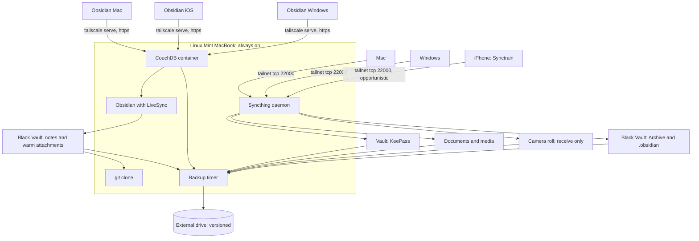

# Personal Cloud: Syncthing, LiveSync and Backup

Replaces iCloud Drive across an iPhone, a Windows machine, a Mac and the Linux Mint MacBook.
The Mint machine is the always-on hub, and every other device is intermittent. All four are on
a Tailscale tailnet, and both sync mechanisms use tailnet addresses only.

No single mechanism covers every workload. The Obsidian vault is itself divided across two of
them along a path boundary. The reasoning for each split is in the Decisions section.

## Architecture



| Layer | Mechanism | Why not the others |
|---|---|---|
| KeePass database | Syncthing, all four devices | Small, infrequent writes, and conflicts are recoverable by merge |
| Documents and own media | Syncthing, all four devices | Ordinary files, no sandbox problem |
| Camera roll | Syncthing, iPhone send-only | iOS will not expose the photo library as a filesystem, so this is a backup rather than a sync |
| Obsidian notes and warm attachments | Self-hosted LiveSync over CouchDB | Syncthing cannot reach Obsidian on iOS at all. See Decisions |
| Obsidian cold archive and `.obsidian` | Syncthing, three desktops | 359MB of write-once binaries that CouchDB handles badly and the phone does not need |
| External backup | Versioned copy from the hub | Syncthing replicates deletions, so it is not a backup |

***

## Decisions

### The hub is not optional

Three of four devices are intermittent, and two intermittent peers rarely have overlapping
wake windows. Syncthing's own guidance is to keep at least one device continuously running.
The Mint machine already runs clamshell with `logind` ignoring lid close, so it qualifies.

Set the hub as **introducer** so it distributes folder config to new devices. Make that
one-directional. Two devices introducing each other is explicitly discouraged upstream.

Introducer status does not force traffic through the hub. Peers still connect directly when
both happen to be awake, so the hub buys convergence rather than a bottleneck.

### Tailscale addressing, not Syncthing discovery

Syncthing's tunnelling documentation describes disabling discovery and relaying in favour of
explicit peer addresses. Applied to a tailnet:

- **Off:** global discovery, local discovery, relaying, NAT traversal
- **Peer address:** `tcp://100.x.y.z:22000` per device

This removes public relay dependence, NAT traversal flakiness, and metadata sent to
`relays.syncthing.net`. Double encryption over WireGuard is negligible for this workload.

**Force TCP on iOS.** MobiusSync issue #238 records an iPhone losing VPN-only reachability
after an iOS update, fixed by an explicit `tcp://` address. QUIC was the cause.

No VPN conflict exists. iOS permits one active tunnel, and Tailscale is the only claimant:
the Syncthing clients are ordinary apps rather than NetworkExtensions.

### Synctrain, not Möbius Sync

| | Synctrain (`pixelspark/sushitrain`) | Möbius Sync |
|---|---|---|
| Stars | 2,025 | 264 |
| Open issues | **0** | 50 |
| License | MPL-2.0 | none |
| Last code push | 2026-08-23 | **2021-03-19** |
| Syncthing version | v2 | v1.x, [#259](https://github.com/MobiusSync/MobiusSync/issues/259) open since Sep 2025 |
| Cost | Free | Free to 20MB, then one-time IAP |

Möbius still works and its author answered a 2026 "still maintained?" thread, but a code
repo untouched since 2021 against a fully open, zero-issue, actively released alternative is
not a close call.

### iOS syncs opportunistically, not continuously

No iOS app runs indefinitely in the background. Möbius' own FAQ says to expect **1 to 2 hours
of sync activity per day** once stable, and possibly 24 hours before the first sync starts.
Community reports describe background sync stopping after a reboot until the app is opened
manually.

Design consequence: **the iPhone is a device you open the app on.** Anything time-critical
travelling to or from the phone needs a manual foreground open, not a promise of background
convergence.

### The Obsidian vault splits across both mechanisms

Neither mechanism covers the vault alone, for two reasons that are independent of each other.

**Syncthing cannot reach Obsidian on iOS.** Obsidian iOS only opens vaults inside its own app
sandbox, and no Syncthing client can write there. Reaching an outside folder requires a
security-scoped bookmark. Möbius labels that feature **dangerous with a chance of data loss**,
and [issue #263](https://github.com/MobiusSync/MobiusSync/issues/263) is two independent
reporters losing **every file across every machine** after a phone woke from idle. The suspected
cause is a stale bookmark presenting an empty folder, whose deletions then replicate everywhere.
Synctrain is the better client but inherits the same sandbox wall, recorded in
[discussion #93](https://github.com/pixelspark/sushitrain/discussions/93) and in
[an iPadOS 18.6 report](https://forum.obsidian.md/t/using-synctrain-on-ipad-ipados-18-6-unable-to-access-the-synced-vault/104343).

**CouchDB handles bulk binaries badly.** Its MVCC model stores a full copy of a document per
revision, and a large attachment cannot resume a transfer broken midway. The reported failures
are exactly this shape: [#359](https://github.com/vrtmrz/obsidian-livesync/issues/359) is large
attachments with a difficult recovery, and
[#762](https://github.com/vrtmrz/obsidian-livesync/issues/762) is a database 74 times the size
of the vault behind it.

The vault therefore divides on a path boundary rather than on a device list. LiveSync carries
what the phone needs and what changes often. Syncthing carries what is bulky and cold.

`vrtmrz/obsidian-livesync` (12.2k stars, MIT, actively pushed) is a real Obsidian plugin. It
replicates through CouchDB, runs natively on Obsidian iOS with no sandbox workaround, and
merges at document level instead of producing whole-file conflicts.

`athNdev/obsidian-sync` is Docker Compose for exactly this shape, CouchDB plus a Tailscale
sidecar plus a backup rotation script. At 4 stars, no license and last pushed 2026-02-08 it
is one person's setup. **Read it for the compose file, do not depend on it.**

### Two mechanisms on one tree, never on one file

What makes the split safe is that no file is reachable by both. The boundary is a path, declared
once and enforced twice, by LiveSync's exclusion regex and by the roots of the Syncthing
folders. Both are specified in the vault's own `Sync Setup` guide.

Filtering by size instead would be the fragile alternative. It puts both mechanisms on the same
subtree under complementary rules, and any disagreement between those rules is a file that
either syncs twice or not at all. The curation habit that keeps a path boundary honest is
simple: **`Attachments/Archive/` means big and cold.** Bulk media moves there rather than being
caught by an extension filter.

### Photos are a backup, and the library does not fit

iOS does not expose the camera roll as a filesystem, so both iOS clients implement custom
Photos code and both are **send only**. Camera roll pushes to the hub, and nothing returns. There
is no two-way library, no shared albums, and no delete-on-one-device semantics.

**Deletions propagate by default.** Deleting a photo on the phone removes it from the hub
unless `ignoreDelete` is set on that folder. For an archive folder, set it.

> [!warning] Disk space decides the scope
> The hub is a 2015 MacBook whose SSD will not hold a full photo library alongside documents,
> media and the vault. **Phase 1 therefore syncs files only:** documents, music, and own
> images and videos that already exist as files. The iPhone camera roll stays on iCloud.
>
> Revisit when the SSD is upgraded. The camera-roll folder is designed but not enabled, so
> enabling it later is a config change rather than a redesign.

### Syncthing is not backup

It replicates deletions, which is the #263 failure mode. The external-drive leg is what makes
that recoverable, so it is part of the design rather than an addition to it.

***

## Folder design

| Folder | Devices | Hub type | Notes |
|---|---|---|---|
| `vault` | all four | Send and receive | KeePass `.kdbx`. Small, syncs fast |
| `documents` | all four | Send and receive | Papers, scans, reference |
| `media` | Mint, Mac, Windows | Send and receive | Music, own images and videos already stored as files. **Excluded from iPhone** on space grounds |
| `camera` | iPhone, Mint | **Receive only** on hub | Designed, disabled in phase 1. Set `ignoreDelete` when enabled |
| `blackvault-archive` | Mint, Mac, Windows | Send and receive | `99 - Meta/Attachments/Archive` inside the vault. 299MB of write-once binaries. **Excluded from iPhone**, which gets its images through LiveSync |
| `blackvault-config` | Mint, Mac, Windows | Send and receive | The vault's `.obsidian`. 60MB across 42 plugins. Desktop plugin set only, the phone keeps its own |

**File versioning on the hub:** staggered versioning on `vault` and `documents`. This is the
local undo for an accidental delete before the nightly backup runs.

### Ignore patterns

`documents` and `media`:

```
(?d).DS_Store
(?d)Thumbs.db
(?d).Trash-*
```

The `(?d)` prefix lets Syncthing delete these locally when they disappear remotely.

`blackvault-config`, mirroring the vault's own `.gitignore`:

```
workspace.json
workspace-mobile.json
plugins/*/data.json
```

Pane layout is per-device and changes constantly, so syncing those two files produces a steady
drip of conflict copies and nothing else.

***

## KeePass discipline

Conflicts are **recoverable, not catastrophic**. Syncthing renames the losing copy to
`<file>.sync-conflict-<date>-<time>-<device>.kdbx` and propagates it as an ordinary file, so
both versions survive on disk. Nothing is silently lost.

KeePassXC resolves this directly: **Database → Merge From Database** compares entries by UUID
and modification time, keeps the newest, and pushes the previous version into entry history.
Its documentation names conflict files from cloud sync as the intended use case.
`keepassxc-cli merge` does the same for scripting.

Two settings that matter:

1. **Safe saves on.** Atomic write to a temp file then move. The default. Never use
   direct-write saves, which is the path to a truncated `.kdbx` mid-sync.
2. **Pre-save backup on.** KeePassXC's own belt and braces.

Single-writer discipline is advisable rather than mandatory. Closing the database on one
device before editing on another avoids the conflict entirely, but forgetting costs a merge
rather than data.

**Clients:** KeePassXC on Mint, Mac and Windows. Strongbox or KeePassium on iOS, both actively
maintained.

***

## Obsidian: the Black Vault

The vault lives at `$WORKSPACE/repos/github/tools/black-vault` on all three desktops, and that
directory is the git working tree itself.

Its operational detail is documented in the vault rather than here, at
`99 - Meta/Guides/Sync Setup.md` in the `black-vault` repo. That covers the path boundary between
the two mechanisms, the LiveSync settings that enforce it, the CouchDB and `tailscale serve`
configuration with its CORS requirements, and why the hub runs Obsidian as a client.

It lives there because it stays true regardless of which machines exist, and because none of its
configuration is managed from this repo. What this repo owns is the Syncthing side of the vault,
the two `blackvault-*` folders in the folder design above, plus the backup and CouchDB service
files listed under Managed files.

***

## Backup to the external drive

The hub is the only backup source, since it holds every folder and is always on.

**Requirement: versioned, not mirrored.** Syncthing propagates deletions within seconds, so a
mirror reproduces the exact failure it is meant to protect against.

### FreeFileSync in Update mode with versioning

Chosen for familiarity, since it already covers the current iCloud-to-external-drive run. The
configuration is what matters:

| Setting | Value | Why |
|---|---|---|
| Variant | **Update**, not Mirror | Mirror deletes on the target whatever vanished on the source. That is the whole problem |
| Deletion handling | **Versioning**, not "Permanent" or "Recycle bin" | Moves replaced and deleted files into a versioning folder instead of removing them |
| Naming convention | **Time stamp (file)** | Keeps every revision. "Replace" keeps only the newest, which defeats the purpose |
| Versioning limits | Keep a generous minimum | The point is surviving a deletion you notice weeks later |

> [!warning] Mirror mode is the trap
> FreeFileSync defaults to a two-way or mirror mindset. Mirror plus a propagated Syncthing
> deletion equals a lost file on both source and backup. Verify the variant reads **Update**
> and the deletion handling reads **Versioning** before the first real run.

Save the configuration as a `.ffs_batch` file so it can run unattended. Set it to ignore
errors rather than pop a dialog, since nothing will be watching.

**Alternatives, if FreeFileSync proves awkward to schedule headless:** `restic` (deduplicating,
encrypted, snapshot-based, prunable) or `rsync --backup-dir` (no new dependency). Both are
strictly better for scripted use, and neither is worth the switch unless FreeFileSync fights
the timer.

### Scheduling

Runs from a **systemd user timer with `Persistent=true`** so a missed window fires on the next
boot rather than being skipped, matching how the vault automation is scheduled. Add
`loginctl enable-linger` so the unit survives logout.

### What to include

- All Syncthing folders
- The Black Vault working tree on the hub, where LiveSync materialises notes and warm attachments
- The CouchDB data directory (the live store behind that working tree)
- The Syncthing config directory, since device IDs and folder keys are painful to rebuild

### Verify the restore

A backup nobody has restored from is a hypothesis. Before step 9 of the rollout, pull a file
out of the versioning folder and confirm it opens. Repeat after any change to the folder set.

***

## Managed files

Following the pattern in `linux-mint-macbook.md`, once implemented:

```text
~/.config/systemd/user/personal-backup.service  -> os/linux/home/systemd/personal-backup.service
~/.config/systemd/user/personal-backup.timer    -> os/linux/home/systemd/personal-backup.timer
~/.local/bin/personal-backup                    -> os/linux/home/personal-backup.sh
~/.config/couchdb/compose.yaml                  -> os/linux/home/couchdb/compose.yaml
```

The compose file is safe to manage because the CouchDB credentials come from an env file in the
separate `secrets/` checkout rather than from the compose file itself.

Two configs are deliberately **not** managed here:

- **Syncthing's own config.** It contains device IDs and folder keys, it is machine-specific,
  and Syncthing rewrites it at runtime. Back it up rather than symlink it.
- **The LiveSync plugin config.** It lives at `.obsidian/plugins/obsidian-livesync/data.json`,
  which holds the CouchDB password and is already excluded from `blackvault-config`. Each device
  is configured by hand, once. A device that silently stops syncing has usually had this file
  reset, not the server.

A guarded `restoration_scripts/` entry follows the same shape as `01-linux-mint-macbook.sh`:
skip unless Linux, not WSL, `linuxmint`, `MacBookPro12,1`.

***

## Rollout order

Each step is independently useful and independently reversible.

| Step | Action | Why this order |
|---|---|---|
| 1 | Syncthing on the hub, Mac and Windows. `vault` folder only | Smallest surface, highest value, and the KeePass merge path gets exercised early |
| 2 | Tailscale-only addressing. Discovery and relays off, static `tcp://` peers | Do this before adding data, so problems surface on one small folder |
| 3 | Add `documents` and `media` | Bulk transfer, desktops only |
| 4 | Synctrain on the iPhone. `vault` and `documents` | Expect opportunistic sync. Verify before trusting it |
| 5 | Enable tailnet HTTPS certificates, then CouchDB on the hub behind `tailscale serve` | The certificate is a prerequisite, and getting it wrong surfaces only on the phone |
| 6 | LiveSync on the Mac alone, notes lane, verified round trip | One client against one server is the only configuration worth debugging in |
| 7 | Move the Mac vault to `$WORKSPACE/repos/github/tools/black-vault` | Leaves the iCloud folder and dissolves the split gitdir in one step |
| 8 | `blackvault-archive` and `blackvault-config`, hub and Mac | The Syncthing half of the vault, on the two devices actually available |
| 9 | Backup timer to the external drive, with a verified restore | **Before** the vault moves off iCloud, so nothing is ever unprotected |
| 10 | LiveSync on the iPhone, then Windows on both mechanisms | Fan out once the shape is proven on two devices |
| 11 | Turn off iCloud Drive for the migrated folders | Last, and only after step 9 has produced a verified restore |

> [!danger] Do not skip step 9
> Between leaving iCloud and having a working versioned backup, a single propagated deletion
> is unrecoverable. Verify a restore from the external drive before disabling iCloud, not
> after.

The Windows side currently keeps the vault at `repos/github/docs/black-vault`. Step 7 normalises
it to `repos/github/tools/black-vault` so the path is identical on all three desktops.

**Deferred:** camera roll (disk space), and any attempt to put the Obsidian vault on iOS
Syncthing (data loss).

***

## Open questions

- Whether `media` stays desktop-only permanently or the SSD upgrade brings the phone in
- Whether FreeFileSync schedules cleanly headless from a systemd timer, or whether the backup
  leg moves to restic
- Whether the hub keeps `blackvault-config`, which depends on how a 2015 MacBook copes with the
  full plugin set
- Whether bulk media already sitting outside `Attachments/Archive/` gets curated in one pass or
  as it is encountered
