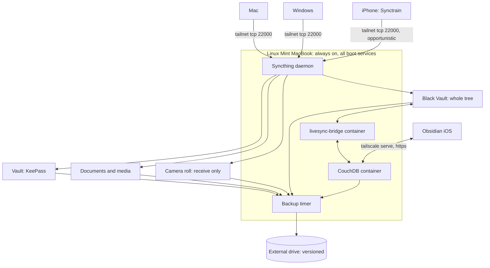

# Personal Cloud: Syncthing, LiveSync and Backup

Replaces iCloud Drive across an iPhone, a Windows machine, a Mac and the Linux Mint MacBook.
The Mint machine is the always-on hub, and every other device is intermittent. All four are on
a Tailscale tailnet, and both sync mechanisms use tailnet addresses only.

No single mechanism covers every workload. Syncthing carries files between machines but cannot
reach Obsidian on iOS. LiveSync reaches iOS but only runs inside Obsidian. The hub bridges the
two, so no device depends on any other device being awake. The reasoning is in the Decisions
section.

## Architecture



| Layer | Mechanism | Why not the others |
|---|---|---|
| KeePass database | Syncthing, all four devices | Small, infrequent writes, and conflicts are recoverable by merge |
| Documents and own media | Syncthing, all four devices | Ordinary files, no sandbox problem |
| Camera roll | Syncthing, iPhone send-only | iOS will not expose the photo library as a filesystem, so this is a backup rather than a sync |
| Obsidian vault, whole tree | Syncthing, three desktops | Propagates continuously with no app open, which is what agent tooling writing to the vault needs |
| Obsidian vault on the iPhone | CouchDB, fed by `livesync-bridge` on the hub | Syncthing cannot reach Obsidian on iOS at all. See Decisions |
| External backup | Versioned copy from the hub | Syncthing replicates deletions, so it is not a backup |

***

## Decisions

### The hub is not optional

Three of four devices are intermittent, and two intermittent peers rarely have overlapping
wake windows. Syncthing's own guidance is to keep at least one device continuously running.
The Mint machine already runs clamshell with `logind` ignoring lid close, so it qualifies.

Set the hub as **introducer** so it distributes folder config to new devices. Make that
one-directional. Two devices introducing each other is explicitly discouraged upstream.

Introducer status does not force traffic through the hub. Peers still connect directly when
both happen to be awake, so the hub buys convergence rather than a bottleneck.

### Tailscale addressing, not Syncthing discovery

Syncthing's tunnelling documentation describes disabling discovery and relaying in favour of
explicit peer addresses. Applied to a tailnet:

- **Off:** global discovery, local discovery, relaying, NAT traversal
- **Peer address:** `tcp://100.x.y.z:22000` per device

This removes public relay dependence, NAT traversal flakiness, and metadata sent to
`relays.syncthing.net`. Double encryption over WireGuard is negligible for this workload.

**Force TCP on iOS.** MobiusSync issue #238 records an iPhone losing VPN-only reachability
after an iOS update, fixed by an explicit `tcp://` address. QUIC was the cause.

No VPN conflict exists. iOS permits one active tunnel, and Tailscale is the only claimant:
the Syncthing clients are ordinary apps rather than NetworkExtensions.

### Synctrain, not Möbius Sync

| | Synctrain (`pixelspark/sushitrain`) | Möbius Sync |
|---|---|---|
| Stars | 2,025 | 264 |
| Open issues | **0** | 50 |
| License | MPL-2.0 | none |
| Last code push | 2026-08-23 | **2021-03-19** |
| Syncthing version | v2 | v1.x, [#259](https://github.com/MobiusSync/MobiusSync/issues/259) open since Sep 2025 |
| Cost | Free | Free to 20MB, then one-time IAP |

Möbius still works and its author answered a 2026 "still maintained?" thread, but a code
repo untouched since 2021 against a fully open, zero-issue, actively released alternative is
not a close call.

### iOS syncs opportunistically, not continuously

No iOS app runs indefinitely in the background. Möbius' own FAQ says to expect **1 to 2 hours
of sync activity per day** once stable, and possibly 24 hours before the first sync starts.
Community reports describe background sync stopping after a reboot until the app is opened
manually.

Design consequence: **the iPhone is a device you open the app on.** Anything time-critical
travelling to or from the phone needs a manual foreground open, not a promise of background
convergence.

### Syncthing cannot reach Obsidian on iOS

This is the constraint the whole Obsidian arrangement exists to work around.

Obsidian iOS only opens vaults inside its own app sandbox, and no Syncthing client can write
there. Reaching an outside folder requires a security-scoped bookmark. Möbius labels that
feature **dangerous with a chance of data loss**, and
[issue #263](https://github.com/MobiusSync/MobiusSync/issues/263) is two independent reporters
losing **every file across every machine** after a phone woke from idle. The suspected cause is
a stale bookmark presenting an empty folder, whose deletions then replicate everywhere.
Synctrain is the better client but inherits the same sandbox wall, recorded in
[discussion #93](https://github.com/pixelspark/sushitrain/discussions/93) and in
[an iPadOS 18.6 report](https://forum.obsidian.md/t/using-synctrain-on-ipad-ipados-18-6-unable-to-access-the-synced-vault/104343).

`vrtmrz/obsidian-livesync` (12.2k stars, MIT, actively pushed) replicates through CouchDB and
runs natively on Obsidian iOS with no sandbox workaround. It is the only free route onto the
phone, so the phone is the only reason CouchDB exists here.

### The hub translates between the two mechanisms, not a desktop

LiveSync is an Obsidian plugin, so it replicates only while Obsidian is open. Putting the
translation on a laptop would mean a phone edit reaching the hub's files only after someone
opened Obsidian, and an agent's file edit reaching the phone only on the same condition. Agent
tooling writes to this vault directly, so that dependency is unacceptable.

`vrtmrz/livesync-bridge` is a headless replicator between a LiveSync CouchDB and a filesystem,
by the plugin's own author. Running it on the hub makes the hub the single translation point:
every device talks only to the hub, and nothing waits on a peer.

> [!warning] It carries no license
> `gh api repos/vrtmrz/livesync-bridge` returns `"license": null`, and upstream ships no image,
> so the hub builds it from source. This is the same standard applied to `athNdev/obsidian-sync`
> below, and it is knowingly accepted here rather than met.
>
> The failure mode is degradation, not loss. If the bridge stops, desktops keep syncing to each
> other through Syncthing and the phone keeps working against CouchDB. The two simply stop
> exchanging until it is fixed, with complete copies on both sides throughout. The fallback is
> running the LiveSync plugin on a desktop, which needs no new infrastructure.

`athNdev/obsidian-sync` is Docker Compose for a similar shape. At 4 stars, no license and last
pushed 2026-02-08 it is one person's setup. **Read it for the compose file, do not depend on it.**

### The vault is not split, and both mechanisms touch the same tree

An earlier design divided the vault on a path boundary so that no file was reachable by both
mechanisms. That is not what runs. Syncthing carries the whole vault, and the bridge translates
the whole tree into CouchDB.

Two mechanisms on one directory is safe here because they meet in exactly one place, on the hub,
which is what the bridge is built to be. A change arriving by either route reaches a stable state
and stops, because both sides compare content rather than replaying events. Adding a second
translation point, such as the LiveSync plugin on a desktop as well, would create a genuine
cycle and must not be done.

Staggered versioning on the hub's Syncthing folder is the safety net for this, and is the reason
it is not optional.

### The LiveSync database is encrypted, the hub's files are not

The CouchDB copy is end-to-end encrypted with path obfuscation, so neither note contents nor
folder structure are readable to anyone holding only CouchDB credentials. Content encryption
without obfuscation would have been half a measure, since document IDs otherwise carry file
paths and note titles are often as revealing as note bodies.

It does not defend against hub compromise. The bridge needs the passphrase in
`dat/config.json` on the same machine as the database, and Syncthing keeps a plaintext copy of
the same vault in `/srv/sync/blackvault` regardless. The threat it addresses is narrower: leaked
CouchDB credentials without filesystem access.

Losing the passphrase costs a database rebuild rather than the notes, because the plaintext vault
still exists on every desktop. That makes this a much softer failure than end-to-end encryption
usually implies, and is why one generated passphrase kept in KeePass is sufficient ceremony.

Enabling either setting later would require rebuilding the database, so both were set before the
first client connected.

### Hub data lives outside the encrypted home

`/home/black` is ecryptfs with filename encryption, and it unlocks only when PAM receives the
login password. A service started at boot therefore cannot read it, and `loginctl enable-linger`
does not help. Autologin does not help either, since it supplies no password to derive the
passphrase from.

So everything the hub serves lives under `/srv`, which is plain:

```text
/srv/sync/blackvault        replicated data
/srv/services/syncthing     device IDs and folder keys
/srv/services/couchdb       compose, .env, database files
/srv/services/livesync-bridge
```

The cost is that the hub's copy is unencrypted at rest. That is a smaller loss than it sounds:
the same content sits unencrypted on the Mac and Windows anyway, and KeePass and Bitwarden
encrypt their own databases regardless of the filesystem. What it buys is a hub that is fully
functional after a reboot with nobody logged in, which is the entire premise of an always-on hub.

Adding a workload later is `mkdir /srv/sync/<name>` and a new Syncthing folder.

### No Obsidian on the hub

Obsidian is an Electron GUI app with no headless mode, and its Flatpak data lives in the
encrypted home. Running it as a boot service would mean Xvfb plus a non-standard config path, on
the machine that is supposed to be the most reliable copy.

It is also unnecessary. Syncthing already delivers every note to the hub as a file, and the
bridge handles CouchDB. Obsidian is installed there for interactive use over RustDesk only, with
a `flatpak override --user` granting access to `/srv/sync/blackvault`, since the sandbox
otherwise reaches only `home`, `/media` and `/mnt`.

### Photos are a backup, and the library does not fit

iOS does not expose the camera roll as a filesystem, so both iOS clients implement custom
Photos code and both are **send only**. Camera roll pushes to the hub, and nothing returns. There
is no two-way library, no shared albums, and no delete-on-one-device semantics.

**Deletions propagate by default.** Deleting a photo on the phone removes it from the hub
unless `ignoreDelete` is set on that folder. For an archive folder, set it.

> [!note] Disk space is not the constraint it was
> The hub has 392GB free of 457GB, so the SSD no longer rules out a photo library. **Phase 1
> still syncs files only:** documents, music, and own images and videos that already exist as
> files. The iPhone camera roll stays on iCloud until the send-only behaviour has been verified,
> which is a correctness question rather than a capacity one.
>
> The camera-roll folder is designed but not enabled, so enabling it is a config change rather
> than a redesign.

### Syncthing is not backup

It replicates deletions, which is the #263 failure mode. The external-drive leg is what makes
that recoverable, so it is part of the design rather than an addition to it.

***

## Folder design

| Folder | Devices | Hub type | Notes |
|---|---|---|---|
| `vault` | all four | Send and receive | KeePass `.kdbx`. Small, syncs fast |
| `documents` | all four | Send and receive | Papers, scans, reference |
| `media` | Mint, Mac, Windows | Send and receive | Music, own images and videos already stored as files. **Excluded from iPhone** on space grounds |
| `camera` | iPhone, Mint | **Receive only** on hub | Designed, disabled in phase 1. Set `ignoreDelete` when enabled |
| `blackvault` | Mint, Mac, Windows | Send and receive | The whole Obsidian vault, ~585MB over 3241 files. Hub path `/srv/sync/blackvault`. **Not shared with the iPhone**, which reaches it through CouchDB instead |

**File versioning on the hub:** staggered versioning on `vault`, `documents` and `blackvault`,
365 days. This is the local undo for an accidental delete before the nightly backup runs, and on
`blackvault` it is also the safety net for two mechanisms sharing one tree.

### Ignore patterns

`documents` and `media`:

```
(?d).DS_Store
(?d)Thumbs.db
(?d).Trash-*
```

The `(?d)` prefix lets Syncthing delete these locally when they disappear remotely.

`blackvault`, anchored at the vault root so nested directories of the same name still sync:

```
/.git
/.codex
/.claude
/.opencode
/.codegraph
/.smart-env
/.trash
(?d).DS_Store
(?d)Thumbs.db
```

`.codex/cache` alone is 310MB of regenerable agent state. The leading `/` matters: without it,
`99 - Meta/Skills/.opencode/` would be excluded too, and that is real vault content.

> [!warning] Avoid `: ? | * < > "` in note titles
> The bridge splits paths on `:` and drops the file. All of these are also illegal in Windows
> filenames, so they break Syncthing to `black-pc` as well. Six notes had to be renamed for this
> reason. `find . -type f | grep -E '[:?|*<>"]'` finds them.

***

## KeePass discipline

Conflicts are **recoverable, not catastrophic**. Syncthing renames the losing copy to
`<file>.sync-conflict-<date>-<time>-<device>.kdbx` and propagates it as an ordinary file, so
both versions survive on disk. Nothing is silently lost.

KeePassXC resolves this directly: **Database → Merge From Database** compares entries by UUID
and modification time, keeps the newest, and pushes the previous version into entry history.
Its documentation names conflict files from cloud sync as the intended use case.
`keepassxc-cli merge` does the same for scripting.

Two settings that matter:

1. **Safe saves on.** Atomic write to a temp file then move. The default. Never use
   direct-write saves, which is the path to a truncated `.kdbx` mid-sync.
2. **Pre-save backup on.** KeePassXC's own belt and braces.

Single-writer discipline is advisable rather than mandatory. Closing the database on one
device before editing on another avoids the conflict entirely, but forgetting costs a merge
rather than data.

**Clients:** KeePassXC on Mint, Mac and Windows. Strongbox or KeePassium on iOS, both actively
maintained.

***

## Obsidian: the Black Vault

The vault lives at `$WORKSPACE/repos/github/tools/black-vault` on all three desktops, and that
directory is the git working tree itself.

Syncthing carries the whole tree between the three desktops and the hub. The iPhone reaches the
same content through CouchDB, which `livesync-bridge` keeps in step with the hub's copy.

Its operational detail is documented in the vault rather than here, at
`99 - Meta/Guides/Sync Setup.md` in the `black-vault` repo: the CouchDB and `tailscale serve`
configuration with its CORS requirements, the bridge's own config, the end-to-end encryption
settings, and the iPhone client setup.

It lives there because it stays true regardless of which machines exist, and because that repo is
private, so it can name hosts and paths this public one should not. What this repo owns is the
Syncthing side of the vault, the `blackvault` folder in the folder design above, plus the service
files listed under Managed files.

***

## Backup to the external drive

The hub is the only backup source, since it holds every folder and is always on.

**Requirement: versioned, not mirrored.** Syncthing propagates deletions within seconds, so a
mirror reproduces the exact failure it is meant to protect against.

### FreeFileSync in Update mode with versioning

Chosen for familiarity, since it already covers the current iCloud-to-external-drive run. The
configuration is what matters:

| Setting | Value | Why |
|---|---|---|
| Variant | **Update**, not Mirror | Mirror deletes on the target whatever vanished on the source. That is the whole problem |
| Deletion handling | **Versioning**, not "Permanent" or "Recycle bin" | Moves replaced and deleted files into a versioning folder instead of removing them |
| Naming convention | **Time stamp (file)** | Keeps every revision. "Replace" keeps only the newest, which defeats the purpose |
| Versioning limits | Keep a generous minimum | The point is surviving a deletion you notice weeks later |

> [!warning] Mirror mode is the trap
> FreeFileSync defaults to a two-way or mirror mindset. Mirror plus a propagated Syncthing
> deletion equals a lost file on both source and backup. Verify the variant reads **Update**
> and the deletion handling reads **Versioning** before the first real run.

Save the configuration as a `.ffs_batch` file so it can run unattended. Set it to ignore
errors rather than pop a dialog, since nothing will be watching.

**Alternatives, if FreeFileSync proves awkward to schedule headless:** `restic` (deduplicating,
encrypted, snapshot-based, prunable) or `rsync --backup-dir` (no new dependency). Both are
strictly better for scripted use, and neither is worth the switch unless FreeFileSync fights
the timer.

### Scheduling

Runs from a **systemd user timer with `Persistent=true`** so a missed window fires on the next
boot rather than being skipped, matching how the vault automation is scheduled. Add
`loginctl enable-linger` so the unit survives logout.

### What to include

- All Syncthing folders
- The Black Vault working tree on the hub, where LiveSync materialises notes and warm attachments
- The CouchDB data directory (the live store behind that working tree)
- The Syncthing config directory, since device IDs and folder keys are painful to rebuild

### Verify the restore

A backup nobody has restored from is a hypothesis. Before step 9 of the rollout, pull a file
out of the versioning folder and confirm it opens. Repeat after any change to the folder set.

***

## Managed files

Following the pattern in `linux-mint-macbook.md`, once implemented:

```text
/etc/systemd/system/syncthing@black.service.d/override.conf
                                    -> os/linux/system/syncthing/override.conf
/srv/services/couchdb/compose.yaml  -> os/linux/home/couchdb/compose.yaml
/srv/services/livesync-bridge/Dockerfile.hub
                                    -> os/linux/home/livesync-bridge/Dockerfile.hub
/srv/services/livesync-bridge/compose.yaml
                                    -> os/linux/home/livesync-bridge/compose.yaml
~/.config/systemd/user/personal-backup.service
                                    -> os/linux/home/systemd/personal-backup.service
~/.config/systemd/user/personal-backup.timer
                                    -> os/linux/home/systemd/personal-backup.timer
~/.local/bin/personal-backup        -> os/linux/home/personal-backup.sh
```

The Syncthing override is what points its config at `/srv/services/syncthing`, which is what makes
the service work at boot without the encrypted home. `Dockerfile.hub` exists because upstream runs
as uid 1993 while Syncthing writes as uid 1000. Building with `USER 1000` keeps every file on the
hub owned consistently by `black`.

Compose files are safe to manage because every credential lives in a sibling file rather than in
them.

Three things are deliberately **not** managed here:

- **Syncthing's own config.** Device IDs and folder keys, machine-specific, rewritten at runtime.
  Back it up rather than symlink it.
- **`/srv/services/couchdb/.env`.** CouchDB admin credentials, mode 0600.
- **`/srv/services/livesync-bridge/dat/config.json` and `dat/e2ee.passphrase`.** These hold the
  CouchDB password and the end-to-end encryption passphrase, both mode 0600. Losing the passphrase
  costs a database rebuild rather than the notes, since the plaintext vault still exists on every
  desktop.

A guarded `restoration_scripts/` entry follows the same shape as `01-linux-mint-macbook.sh`:
skip unless Linux, not WSL, `linuxmint`, `MacBookPro12,1`.

***

## What is running

| Piece | State |
|---|---|
| Vault out of iCloud, at `$WORKSPACE/repos/github/tools/black-vault` | Mac, content hash verified identical to the hub |
| Syncthing 2.1.3 | Mac and hub, tailnet-only addressing, discovery and relaying off |
| Syncthing on the hub | system service enabled at `multi-user.target`, config on `/srv` |
| Docker CE with Compose | enabled at boot |
| CouchDB 3.5 | loopback only, CORS incl. `capacitor://localhost`, `require_valid_user` |
| `tailscale serve` | Let's Encrypt certificate on the MagicDNS name, tailnet only |
| `livesync-bridge` | built from source as uid 1000, boot service |
| LiveSync database | end-to-end encrypted, with path obfuscation, one shared passphrase |
| Obsidian on the hub | Flatpak, `--filesystem` override for the vault, interactive use only |

Everything on the hub is a boot service. None of it needs the encrypted home unlocked, a
graphical session, or a login.

## Remaining

| Step | Why this order |
|---|---|
| iPhone: LiveSync client, fetch from remote | The remote already holds the vault, so this device only pulls |
| Windows: Syncthing, `blackvault` and the rest | Fan out once the shape is proven on two machines |
| Backup timer to the external drive, **with a verified restore** | Before iCloud is switched off, so nothing is ever unprotected |
| Turn off iCloud Drive for the migrated folders | Last, and only after a restore has actually been performed |

> [!danger] Do not switch off iCloud before a verified restore
> Between leaving iCloud and having a working versioned backup, a single propagated deletion is
> unrecoverable. Pull a file out of the versioning folder and confirm it opens first.

The Windows side keeps the vault at `repos/github/docs/black-vault`. Normalise it to
`repos/github/tools/black-vault` when it joins, so the path is identical on all three desktops.

**Deferred:** camera roll, and any attempt to put the Obsidian vault on iOS Syncthing, which is
impossible rather than merely unwise.

***

## Open questions

- Whether FreeFileSync schedules cleanly headless from a systemd timer, or whether the backup leg
  moves to restic
- Whether `livesync-bridge` proves reliable enough to keep, given it carries no license and is
  built from source. The fallback is the LiveSync plugin on a desktop, which needs no new
  infrastructure but reintroduces a dependency on Obsidian being open
- Whether the camera roll comes in now that the hub has 392GB free, which makes this a question
  about send-only correctness rather than capacity
- Whether `media` stays desktop-only or the phone joins
