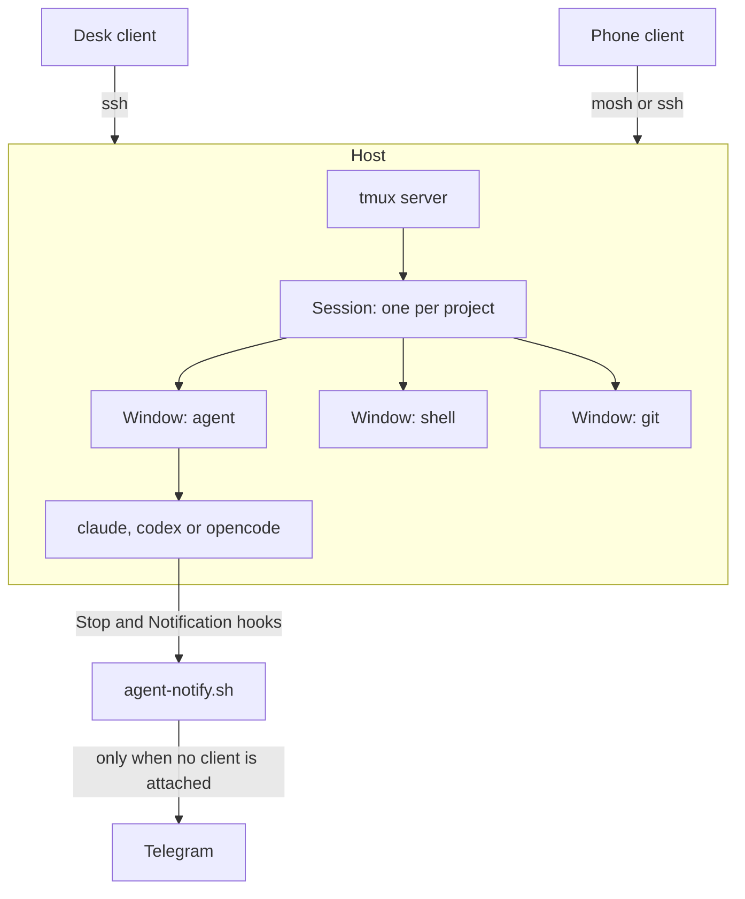

# Persistent Agent Sessions over tmux

Coding agents run for minutes at a time and hold state no transcript recovers.
A dropped Wi-Fi connection, a closed laptop lid or a switch from office to
hotspot kills the SSH connection, and with it every child process. tmux moves
the agent off the connection and onto the host, so disconnecting becomes a
detach rather than an abort.

This repository owns the configuration. The operational guide, the host names
and the recovery procedure live in the private vault, because a public
repository should not name a private machine.

Applies to Claude Code, Codex and OpenCode equally. None of them knows it is
inside tmux, which is the point.

## Architecture



| Layer | Purpose | Managed files |
|---|---|---|
| tmux configuration | Terminal behaviour the agent TUIs depend on | `config/tmux/tmux.conf` |
| Session launcher | Create, attach and reach sessions, locally or over SSH | `scripts/agent-session.sh` |
| Notification | Report on a detached session, finished or blocked | `scripts/agent-notify.sh`, `config/claude/settings.json`, `config/codex/config.baseline.toml` |
| Aliases | Short forms for daily use | `aliases/.tmux-aliases` |
| Telegram bridge | Control a session from a phone, any agent | `scripts/agent-bridge.py`, `os/linux/srv/agents/bridge.env.sample`, `os/linux/system/etc/systemd/system/agent-bridge.service` |
| Hub staging | Plaintext copies for a host whose home is encrypted | `restoration_scripts/51-agent-sessions.sh` |
| SSH key readability | Key login that works before the home is unlocked | `os/linux/system/etc/ssh/sshd_config.d/01-dotfiles-authorized-keys.conf` |
| Packages | `mosh` for mobile links, `claude-code-tools` for `tmux-cli` | `os/linux/apt/packages.mint.txt`, `langs/python/uv_tools.txt` |

## The configuration, and why

`config/tmux/tmux.conf` is linked to `~/.tmux.conf` by `symlinks/conf.yaml`.
Most of it exists because an agent TUI is not an ordinary program.

| Setting | Reason |
|---|---|
| `allow-passthrough on` | OSC sequences reach the outer terminal. Without it, titles, progress reports and notifications stop at tmux |
| `extended-keys on` plus `xterm*:extkeys` | Shift+Enter stays distinguishable from Enter, which is how both agents take a newline inside a prompt instead of submitting |
| `escape-time 25` | Esc is the interrupt key in both agents. The 500ms default makes it feel broken. 25ms stays responsive without splitting escape sequences that arrive in separate packets over a relayed mobile link |
| `history-limit 200000` | The run is the artifact. A few MB per pane buys reading what happened instead of guessing |
| `set-clipboard on` | OSC 52 copies from the remote session into the local clipboard, with no round trip through a file |
| `window-size latest` | A phone attaching does not shrink the session for the desk. Sizing follows the active client rather than the smallest one |
| `status-position top` | The iOS keyboard covers the bottom of the screen, which is where the session name and window list would otherwise sit |
| `automatic-rename off` | Reattaching from a phone means picking a window from a list. A name that tracks the running process is useless for that |

The prefix stays `C-b`. `C-a` is beginning-of-line in every shell here, which
the Linux keyd configuration deliberately preserves, and moving the prefix onto
it would take that back.

Reload after an edit with `tmuxcfg` to open it, then prefix `R`.

## The launcher

`ags` is the interactive alias for `scripts/agent-session.sh`. The hub also
has `agent-session` on PATH. Bare `ags`, `ags --help`, and
`agent-session --help` show the same usage. Use `ags remote --help` for the hub
from another machine. Before the encrypted home is unlocked, use
`/srv/services/agents/bin/agent-session --help`.

The terminal and Telegram use the same core verbs. `new` and `resume` start
detached. Both preserve a session that is already running. To watch it in a
terminal, use `ags open NAME`.

| Action | Terminal | Telegram |
|---|---|---|
| List | `ags ls` | `/ls` |
| Start fresh | `ags new vault codex` | `/new vault codex` |
| Continue saved conversation | `ags resume vault codex` | `/resume vault codex` |
| Stop session | `ags kill vault` | `/kill vault` |
| Read pane | `ags peek vault 15` | `/peek 15` in its topic, `/peek vault 15` in General |
| Send input | `ags say vault "continue"` | `/say continue` in its topic, `/say vault continue` in General |
| Interrupt | `ags esc vault` | `/esc` in its topic, `/esc vault` in General |
| Press Enter | `ags enter vault` | `/enter` in its topic, `/enter vault` in General |
| Help | `ags --help` or `ags help` | `/help` |

`claude` is the default agent. `codex`, `opencode` and `shell` are also accepted.
`new` and `resume` accept `--agent NAME` as an alternative to the positional
agent, and `--dir PATH` for a custom directory.

Terminal attachment remains `ags open NAME`, which also supports creating a
missing session with the existing `--agent`, `--dir` and `--resume` options.
`--detached` suppresses attachment. `ags mobile NAME` explicitly adds another
terminal client, `ags remote COMMAND ...` runs the command on the hub, and
`ags unlock` unlocks its encrypted home. Telegram's `/bind NAME` associates a
topic with a running session. Existing aliases remain available.

Pane commands resolve the active pane of the `agent` window, independent of
which window a terminal client is viewing. Sessions without an `agent` window
use their selected window. Text is sent literally, with Enter as a separate
keystroke. Terminal `peek` prints text. Telegram `peek` renders a PNG with text
fallback. Both default to 30 lines and clamp numeric requests to 1 through 60.

A session gets three windows: `agent`, `shell`, `git`. These are terminal
workspaces within one session. `shell` and `git` start as ordinary shells.
The count describes windows, not the number of agents.

`ags ls` reads the foreground program and directory from the `agent` window,
even when another window is selected. A shell there is shown as `shell (zsh)`
or its equivalent. Sessions without an `agent` window use their selected
window. `ATTACHMENT` counts terminal clients, not Telegram users. `detached`
means no terminal is attached to that session, and does not mean it is stopped.
`RUNNING` reports the foreground program, not an inferred busy or idle state.

The working directory
resolves from `AGENT_SESSION_ROOT`, then `BLACK_VAULT_REPO`, then
`BLACK_VAULT`, then the hub's vault path, then the current directory.

Four details in there are not obvious and were each found by something
breaking.

**The agent is typed into a shell rather than run as the window's command.**
A window whose command exits takes the window with it, and the output goes
too. Starting a shell first means a crash leaves a pane holding the traceback.

**`tmux -f` is honoured only by the command that starts the server.** A session
created against an already-running server silently gets the default
configuration instead, which shows up as 0-indexed windows and 2000 lines of
scrollback. `tmux start-server` does not help, because a server with no
sessions exits immediately. So the config rides on `new-session`, and a
`source-file` covers the already-running case, applied before any window exists
because `base-index` is read at window-creation time.

**A non-login SSH command does not source the shell rc.** `ssh host 'claude'`
fails with command not found while `ssh -t host` into a login shell works,
because both agents install into `~/.local/bin`. The launcher prepends it.

**Grouped sessions are how two devices attach at once.** `ags mobile` creates a
session in the same group, sharing the windows but keeping its own size and its
own current window. Cleanup is a `client-detached` hook rather than
`destroy-unattached on`, which reaps the session the moment it is created,
before there is a client to attach.

### Resuming

`ags resume NAME [agent]` (or `ags open NAME --resume`) types the agent's own continue command instead of a bare
invocation: `claude --continue`, `codex resume --last`, `opencode --continue`.
Each resolves the most recent conversation in the session's working directory,
so the launcher's directory resolution is what makes it deterministic.

A session is a process and a conversation is a file. Killing the first, or
rebooting the host, leaves the second alone, which is why `/resume` can rebuild
a session and carry on mid-thread. To pick from a list instead of taking the
most recent, type `claude --resume` or `codex resume` in the pane, since those
open an interactive picker.

## Notifications

`scripts/agent-notify.sh` reports on a detached session. It stays silent while
a tmux client is attached, so working at the desk produces nothing.

Two events, and the difference matters. A session that *finished* can wait. A
session *blocked on a permission prompt* is doing nothing until you come back.

```text
✅ black-vault finished          🔔 black-vault needs you
Claude code tmux set-up guide    main · 2 changed
main · 2 changed                 “Claude needs your permission to use Bash”
“Reload worked. Confirmed...”
```

| Agent | Wiring | Events |
|---|---|---|
| Claude Code | `Stop` and `Notification` hooks in the `config/claude/settings.json` baseline | Finished, and blocked or idle |
| Codex | `notify` in the `config/codex/config.baseline.toml` baseline | Finished only |

Codex's notification enum has exactly one variant, `agent-turn-complete`, so
there is no blocked-on-a-prompt ping there. That is an upstream limit rather
than a gap here.

Neither config is symlinked. Both agents rewrite their own file at runtime,
Codex with project trust levels, plugin hook hashes and agent registrations, so
`02-seed-runtime-configs.sh` seeds them instead under one rule: add-only,
live wins. The TOML seeder handles top-level keys only, and substitutes
`XXX_DOTFILES_PATH_XXX` because Codex executes the argv directly and TOML
performs no variable expansion.

The two agents deliver their payload differently, and the script reads both:
Claude Code on stdin, Codex as `argv[1]`. From a Claude Code payload it also
reads the transcript for the generated session title and the final assistant
message. From Codex it uses `last-assistant-message` directly.

### What may leave the machine

Agent output is included only for sessions rooted in an allowlisted directory.
The default list is the personal repository roots, the vault and this repo.
Work repositories are deliberately absent, so a session under
`~/Workspace/repos/work` reports repository, branch and changed-file count and
withholds the body.

The check fails closed. A path under no known root withholds the body rather
than sending it, which is the safe direction when the list falls out of date.
Override with `AGENT_NOTIFY_BODY_ROOTS`, colon separated.

Credentials come from `secrets/secrets.sh`, which a hook does not inherit, so
the script sources it itself. It never fails an agent turn: every failure path
exits 0.

This is one-way reporting on purpose. For answering a permission prompt from a
phone, Claude Code ships Remote Control and an official Telegram channel plugin,
both of which beat hand-rolling a bot. Codex has neither, which is why this
script covers both agents and those do not.

Check it without sending anything:

```bash
scripts/agent-notify.sh --dry-run --force --label test
printf '{"hook_event_name":"Stop","cwd":"%s"}' "$PWD" | scripts/agent-notify.sh --dry-run --force
```

## The Telegram bridge

`scripts/agent-bridge.py` is a control plane for sessions, not for agents. It
works at the tmux layer, so a pane is a pane whether Claude Code, Codex or
OpenCode is running in it, and none of them needs to know the bridge exists.
That is the whole reason it is not the official Telegram plugin, which is
Claude Code only.

Each tmux session gets its own Telegram forum topic. Inside a topic the session
is implied, so a plain reply is typed into that pane. Answering a permission
prompt from a phone is then just replying to the message that told you about it.

| Piece | Role |
|---|---|
| `serve` | Long-polls `getUpdates` and acts on messages and button presses |
| `notify` | Posts one message into a session's topic, called by `agent-notify.sh` |
| `doctor` | Checks configuration, bot reachability and tmux, and reports ids |

```text
/ls             list sessions and whether each is allowed
/new S [agent]  start a session through the launcher, default claude
/resume S [a]  continue the last conversation if the session is stopped
/bind S         bind a topic to a session that already exists
/kill S         close a session and its agent
/peek [n]       colour PNG of the pane, default 30 lines, maximum 60
/say TEXT       type text and press Enter
/esc            interrupt
/enter          press Enter
/id             report chat, thread and session ids, for setup
/discover       run on the host, not in chat, to get ids before first start
```

`/new` and `/resume` call the launcher's matching detached commands, so they
have the same lifecycle behavior as `ags new` and `ags resume`. `/bind` handles
Telegram topic association. `/open` remains a compatibility alias for `/bind`.
Inside a topic, the session is inferred. In General, pane commands take the
same explicit session name as their terminal counterparts.

Buttons on a notification cover the same ground without typing: peek, `1`, `2`,
and interrupt. They send the keystrokes a human would press rather than
pretending to understand the prompt, because approving is positional in a TUI.

### Privacy mode, and sharing a bot

Two Telegram facts shape deployment more than any code here.

**Privacy mode.** On by default. A bot in a group then receives only commands,
mentions, and replies to its own messages, so a plain message in a topic never
arrives. `doctor` reports which state the bot is in. Disable it in BotFather
and re-add the bot to the group, or stay on `/say` and Telegram replies.

**One long-poller per token.** `getUpdates` is exclusive. A second consumer on
the same token, such as an OpenClaw gateway, means both steal each other's
updates and one receives `409 Conflict`. Give each deployment its own bot.

The bridge publishes its command menu scoped to the configured chat rather than
globally, so a token shared with another deployment keeps that deployment's
menu everywhere else.

### The pinned guide

The operating guide that sits pinned in the group is a `GUIDE` constant in
`agent-bridge.py`, not a message someone typed once. It is versioned with the
commands it describes, staged to the hub by the same restore step, and rendered
with the live session allowlist substituted in.

```bash
agent-bridge.py guide --show    # print it, send nothing
agent-bridge.py guide --pin     # post and pin it, first time only
agent-bridge.py guide           # edit the pinned one in place
```

Editing in place is what keeps the pin. Posting a new message would need
pinning again and would leave the old one behind.

`serve` refreshes it on start when a guide message id is already stored, so
changing the text and restarting is enough to update the group. It never
creates one unasked: `--pin` is an explicit decision, because it posts and pins
in a shared chat.

The message id lives in `bridge-state.json`. If the message is deleted, the
next edit fails, the id is dropped, and `--pin` posts a fresh one.

### Topic lifecycle

`bridge-state.json` maps session name to `message_thread_id`. Topics outlive
sessions deliberately: the history is the record, and reusing a name returns to
the same thread.

A deleted topic is replaced immediately on the next delivery, including a
`/new` or `/resume` response. An existing session and topic are reused.
Only Telegram's explicit missing-topic error invalidates the mapping. Network
failures, rate limits, closed topics and formatting errors preserve it.
If creation fails, session output is not redirected into General.

Topic lookup, creation and replacement are serialized across the daemon and
notification hooks. State writes use an atomic rename and a separate file
lock. Writers apply only changed fields against their loaded snapshot, so an
old polling process cannot restore a deleted mapping or erase a newer one.

`/bind NAME` inside an existing forum topic associates that topic with the
session. In General it finds or creates the session's topic. This also lets you
recover an orphaned topic if the state file was lost.

### Pane images and deployment

`/peek` and the Peek button render ANSI output with
[Charmbracelet Freeze](https://github.com/charmbracelet/freeze), then upload a
PNG using Telegram's [sendPhoto](https://core.telegram.org/bots/api#sendphoto).
Tap the image to zoom. `/peek 15` gives a shorter view on a phone.
Rendering preserves terminal colours and uses the captured column width
without resizing the live pane. A render timeout or unavailable image upload
falls back to an escaped text block.

Freeze is optional. Install it from the upstream release packages or with
`brew install charmbracelet/tap/freeze`. The bridge checks `AGENT_BRIDGE_FREEZE`, then PATH, then the hub bin directory,
`~/.local/bin`, `~/go/bin`, `/usr/local/bin`, and the bridge script directory.
The restore step copies a PATH-installed Freeze binary beside the bridge.
The hub's staged version is v0.2.2. No binary is committed to dotfiles.

Stage changes with `restoration_scripts/51-agent-sessions.sh`. The daemon
checks its script modification time between polls and re-executes when it
changes. The first deployment to a daemon without that check needs a restart:

```bash
sudo systemctl restart agent-bridge
systemctl is-active agent-bridge
```

The unit allows 60 seconds to stop, covering the 40-second HTTP timeout.
`KillMode=process` stops only the bridge, preserving tmux servers and agents
started from Telegram across a service restart. Install the unit and run
`sudo systemctl daemon-reload` before the first restart.
Updates are persisted before dispatch, choosing at-most-once handling over
replaying keystrokes. A crash after persistence can lose an action, so inspect
the pane before resending it.

Run the offline regression suite with:

```bash
python3 scripts/test_agent_bridge.py
python3 scripts/test_agent_session.py
```

The bridge never deletes a topic. Removing one is a human decision about
history.

### Security

Anything that can type into a pane can run code on the host. Three gates, all
required, all fail closed:

1. the update's chat must be the configured chat
2. the sender's Telegram user id must be in `AGENT_BRIDGE_ALLOWED_USER_IDS`
3. the target session must match `AGENT_BRIDGE_SESSIONS`

Text is sent with `tmux send-keys -l`, so a message containing something like
`C-c` arrives as characters rather than as a key. Enter is always a separate,
deliberate call.

The daemon makes outbound HTTPS long-poll requests and listens on nothing.

### Two tmux details that cost an hour

`tmux -f` is honoured only by the command that starts the server, and
`start-server` does not count because a server with no sessions exits at once.

Pane operations resolve a concrete pane id from `list-windows -t "=NAME"`.
The `agent` window wins over the selected window, so switching to `shell` or
`git` does not redirect Telegram input. Literal text and its Enter keystroke
use the same resolved id.

### Alternatives, and when to revisit

Single-file stdlib Python was chosen for one reason: no pip, no venv, no
runtime to keep current, and it runs identically on a Mac and on a headless hub
whose home is encrypted at boot. That reason is worth re-examining when any of
the following changes.

| Option | Why not now | Revisit when |
|---|---|---|
| `python-telegram-bot` | Adds a uv tool dependency for retries, rate limits and button plumbing that ~450 lines already handle. The library has broken across major versions before | Webhooks, media, or per-user rate limiting become real requirements |
| Claude Code's official Telegram plugin | Claude Code only, and the point here is one control plane for three agents | Codex and OpenCode grow equivalent channel support |
| Claude Code Remote Control | Excellent and zero-effort, but again Claude Code only, and it is a window onto a session rather than a primitive to build on | Never a replacement for the multi-agent case, but worth using alongside |
| OpenClaw as the gateway | Already installed on the hub and chosen for the assistant role, but unconfigured, self-rated alpha, and gated in the vault's runbook behind working vault version control | The runbook's gate clears. The bridge's verbs then become the tools OpenClaw calls, rather than being replaced |
| Node, for a shared runtime with OpenClaw | The hub's Node comes from nvm inside the encrypted home, which a boot service cannot read | Node moves to a system path, or the bridge stops needing to start at boot |

The shared verbs are `ls`, `new`, `resume`, `kill`, `peek`, `say`, `esc` and
`enter` against a named session. Whatever drives them later, that
surface is the part worth keeping.

## tmux-cli

`claude-code-tools` in `langs/python/uv_tools.txt` provides `tmux-cli`, which
lets an agent launch a command in a sibling pane, send input to it, capture its
output and wait for it to go idle. That covers the case an agent otherwise
handles badly: a long-running or interactive process it needs to watch rather
than block on.

The package installs 18 executables. `tmux-cli` is the reason it is here. The
rest are unused.

Its own guidance is worth repeating: launch a shell first, then send the
command into it, so a failure leaves the output visible rather than closing the
pane. The launcher above follows the same rule for the same reason.

## The encrypted-home problem

On a host whose home is ecryptfs, the home unlocks only when PAM receives the
login password. Three consequences, each of which has bitten:

**`~/.tmux.conf` is unreadable before that unlock.** So
`restoration_scripts/51-agent-sessions.sh` stages a plaintext copy at
`/srv/services/agents/tmux.conf`, and the launcher falls back to it. Copies
rather than symlinks, because a link from `/srv` into the encrypted home
dangles exactly when it is needed. The same reasoning already governs
`/etc/keyd/default.conf`.

**The agents themselves are unreachable before that unlock**, because they
install into `~/.local/bin` with their state in `~/.claude` and `~/.codex`. One
`ags unlock` fixes it for the rest of the uptime. This is accepted rather than
solved: relocating both toolchains would fight both installers and put agent
auth tokens in plaintext.

**Key-based SSH fails entirely before that unlock**, because the default
`AuthorizedKeysFile` is inside the home. Combined with a hardened sshd that
disables password authentication, a reboot with nobody logged in makes the host
unreachable until someone touches it physically.
`01-dotfiles-authorized-keys.conf` lists a plaintext path alongside the home
one, so the home copy stays authoritative while mounted and the `/etc` copy
answers when it is not.

## Verification

```bash
tmux -f config/tmux/tmux.conf -L cfgtest new-session -d 'sleep 5' && echo loaded
tmux -L cfgtest show-options -g history-limit
tmux -L cfgtest show-options -gw allow-passthrough
tmux -L cfgtest kill-server

scripts/agent-session.sh new scratch shell --dir /tmp
tmux list-windows -t scratch          # expect 1-indexed
scripts/agent-session.sh kill scratch

scripts/agent-notify.sh --dry-run --label test
```

On the hub, after `51-agent-sessions.sh`:

```bash
cmp /srv/services/agents/tmux.conf "$DOTFILES_PATH/config/tmux/tmux.conf"
sudo sshd -T | grep -i authorizedkeysfile
sudo stat -c '%U:%G:%a %n' /etc/ssh/authorized_keys/"$USER"
command -v mosh-server
```

## Troubleshooting

### The session has default settings

A tmux server was already running when it was created. Confirm with
`tmux show-options -g history-limit`, which returns 2000 instead of 200000.
Apply the configuration to the running server with prefix `R`, or
`tmux source-file ~/.tmux.conf`. New sessions from the launcher handle this
themselves.

### Shift+Enter submits instead of inserting a newline

The outer terminal is not advertising extended keys. Check
`tmux show-options -s extended-keys`, and run `/terminal-setup` in Claude Code.
Some terminals need their own setting as well.

### `claude: command not found` over SSH

A non-login shell. Use `ssh -t <host>` or an absolute path. The launcher does
this for you, which is why `ags remote` invokes the hub copy by full path.

### Esc does not interrupt the agent

`escape-time` is back at its default. Check `tmux show-options -s escape-time`.

### An unquoted session target behaves strangely in zsh

`-t =name` triggers zsh equals-expansion and fails with
`zsh: name not found`. Quote it as `-t "=name"`. The scripts here already do.
